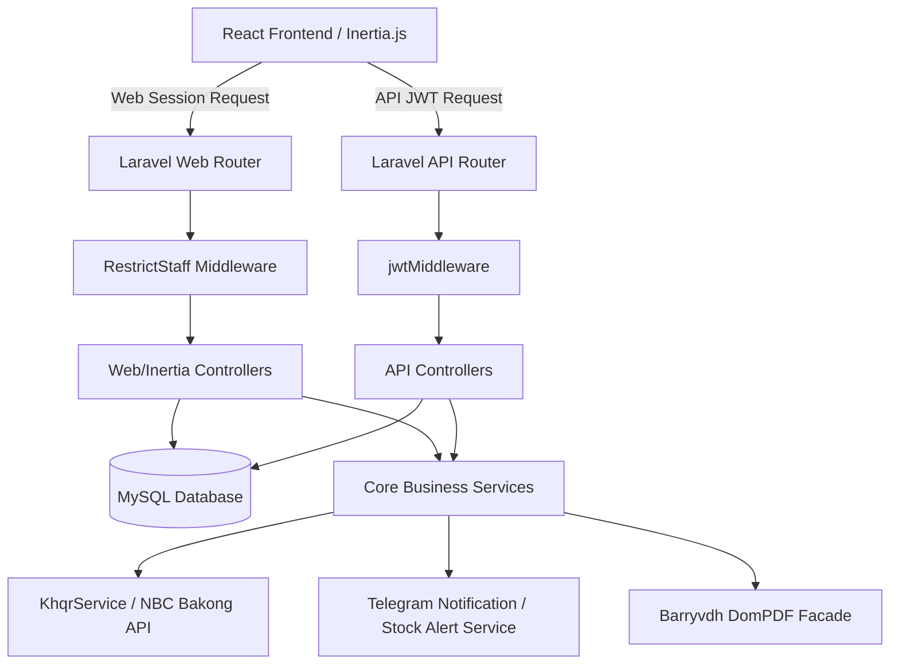

# POS Management System

A web-based Point of Sale (POS) and Cashier Management System built with Laravel and React to streamline product management, sales transactions, and inventory tracking.

> A web-based Point of Sale (POS) and Cashier Management System built with Laravel and React to streamline product management, sales transactions, and inventory tracking.

---

## Preview

### Dashboard Analytics


### Payments POS Terminal


### A4 PDF Invoice Receipt


---

## Features

- **User Authentication**: Secure cashier logins and profile management.
- **Role-Based Authorization**: Spatie permissions restricting dashboard access and locking staff/cashiers inside the POS terminal.
- **Product Management**: Full CRUD operations with search, category filtering, barcode support, and multi-image uploads.
- **Category & Attribute Management**: Main Categories, Sub Categories, Sizes, Units, Makers, and Brands.
- **Inventory Tracking**: Database-backed stock subtraction with transaction locks to prevent concurrency conflicts.
- **Point of Sale (POS)**: Dynamic checkout cart supporting discount deductions, walk-in/saved customer assignments, and change calculation.
- **Bakong KHQR Payments**: Embedded KHQR gateway integration for dynamic QR generation, polling status, and simulated webhook confirmations.
- **Receipt Generation**: Direct printouts and downloadable A4 PDF records generated via `barryvdh/laravel-dompdf`.
- **Telegram Notification System**: Real-time sales notifications, low inventory stock alerts, and daily sales summaries sent directly to Telegram groups.

---

## Tech Stack

| Layer | Technology | Version / Context |
| :--- | :--- | :--- |
| **Backend** | Laravel 11.x | PHP ^8.2 |
| **Frontend** | React | 18.2.0 |
| **Bridge** | Inertia.js | 1.0.0 |
| **Styling** | Tailwind CSS & Bootstrap | Tailwind 3.2.1 / Bootstrap 4.3.1 |
| **Theme** | AdminLTE | 3.2.0 |
| **Database** | MySQL | 8.0+ |
| **Authentication** | Laravel Breeze & JWT Auth | Breeze (Web) / Tymon JWT (API) |
| **PDF Processing**| Barryvdh DomPDF | 3.1 |
| **Deployment** | Railway | Configured via `railway.json` |

---

## System Architecture



---

## Folder Structure

```text
app/
 ├── Http/
 │    ├── Controllers/    # Web and API request endpoints
 │    └── Middleware/     # Redirection wall (RestrictStaff) and permissions check
 ├── Models/              # Database models (Product, Order, Invoice, User, etc.)
 ├── Services/            # Business logic integrations (Bakong KHQR, Telegram Alerts)
 └── Console/             # Scheduled commands (daily sales report dispatcher)

resources/
 ├── js/                  # Inertia.js React SPA views, components, and hooks
 └── views/               # Blade templates for A4 PDF receipts

routes/                   # Web and API routing scripts

database/                 # Database migrations and seeders (Permissions, Users)

public/                   # Compiled assets and logos
```

---

## Installation

```bash
# Clone the repository
git clone https://github.com/Xianghao1108/TOS_TINH-POS-SYSTEM.git
cd TOS_TINH-POS-SYSTEM

# Install dependencies
composer install
npm install

# Setup environment variables
cp .env.example .env

# Generate keys
php artisan key:generate
php artisan jwt:secret

# Setup database & seed
php artisan migrate --seed

# Start development server
composer dev
# Alternatively run: php artisan serve & npm run dev
```

---

## Environment Variables

| Variable | Description | Default / Example Value |
| :--- | :--- | :--- |
| `APP_ENV` | Mode of operation | `local` |
| `APP_KEY` | Application encryption key | Generated via `key:generate` |
| `JWT_SECRET` | Secret key for signing API tokens | Generated via `jwt:secret` |
| `DB_DATABASE` | MySQL database name | `sample_laravel_11` |
| `DB_USERNAME` | Database username | `root` |
| `DB_PASSWORD` | Database password | `your_password` |
| `BAKONG_API_URL` | NBC Bakong API endpoint | `https://sit-api-bakong.nbc.gov.kh/` |
| `BAKONG_ACCOUNT_ID` | Bakong merchant account code | `tos_tinh_store@usd` |
| `TELEGRAM_BOT_TOKEN` | Bot token for receipt updates | `123456:ABC-Def...` |
| `TELEGRAM_STOCK_BOT_TOKEN`| Bot token for stock alerts | `123456:XYZ-Wuv...` |
| `TELEGRAM_REPORT_BOT_TOKEN`| Bot token for sales summaries | `123456:MNO-Pqr...` |

---

## User Roles

### Admin
- Bypasses all staff restrictions to access full features.
- Manage products, categories, subcategories, inventory, and brands.
- View dashboard metrics, transactions, and download invoices.
- Manage users, roles, and edit store/Telegram setting variables.

### Staff
- Restricted from access to dashboard and settings.
- Automatically redirected by middleware to the POS screen (`/orders`).
- Process sales checkouts (Cash & KHQR).
- Edit products, categories, and customers.

### User
- Walk-in / API account restricted exclusively to point-of-sale operations.
- Process sales checkouts.
- Blocked from administrative and product management paths.

---

## Application Workflow

```
Login
  ↓
Dashboard (Admin) / POS screen (Staff/User)
  ↓
Manage Products (Create, upload images, set SKU)
  ↓
Stock Inventory (Track stock quantities)
  ↓
Open POS terminal (/orders)
  ↓
Add Items to Cart (Dynamic quantity, select customer, apply discount)
  ↓
Checkout
  ↓
Payment (Select Cash or scan Bakong KHQR)
  ↓
Receipt (Print or download consolidated PDF)
  ↓
Sales Report (Automated Daily Sales Telegram update)
```

---

## Database Overview

- **Users**: Cashier and admin credentials associated with Spatie roles and permissions.
- **Customers**: Profiles for walk-in or registered buyers.
- **Products**: Detailed items containing stock levels, pricing, barcode SKU, and category/brand links.
- **Product Images**: Libraries of uploaded files mapping to physical storage.
- **Categories & Subcategories**: Structural hierarchies for grouping items.
- **Sizes, Units, Makers, Brands**: Specific product attributes.
- **Orders**: Finalized sale documents detailing subtotal, discount, total, and payment method.
- **Order Items**: Product line items snapped at historical sale prices.
- **Payments**: KHQR transaction tracker mapping order IDs to MD5 signatures and payment statuses.
- **Invoices**: Consolidated billing files linked to one or many orders.
- **Pos Invoices**: Transactions captured via the secondary simple POS screen (`pos_invoices`/`pos_invoice_items`).

---

## API

```text
// API Auth Endpoints
POST /api/auth/login                       # Authenticate client and return JWT token
POST /api/auth/register                    # Create user account

// KHQR & Checkout API
POST /api/create-payment                   # Initialize order, decrement stock, and fetch KHQR code
GET  /api/payment-status/{payment_id}      # Poll NBC API to check if KHQR is successfully paid
POST /api/payment-webhook                  # Simulates webhook callback for testing
POST /api/bakong/webhook                   # Production webhook handler for NBC Bakong API

// Operations Endpoints
POST /api/reports/trigger-now              # Trigger Daily Sales Report Artisan command on demand
POST /api/invoices/checkout                # Simple POS checkout (writes directly to PosInvoices)
```

---

## Screenshots

### Dashboard
*Placeholder: *

### Products
*Placeholder: *

### POS
*Placeholder: *

### Reports
*Placeholder: *

### Settings
*Placeholder: *

---

## Deployment

### Railway Deployment
1. Set up a MySQL database service inside Railway.
2. Link your repository.
3. Configure environment variables in Railway's variables panel.
4. Railway will automatically run migrations and start the server using the configuration specified in the root `railway.json`.

### Production Workers
To process Telegram notification jobs asynchronously and keep your scheduler active:
- **Scheduler Cron**: Add this to your server's crontab config:
  ```bash
  * * * * * cd /path-to-your-project && php artisan schedule:run >> /dev/null 2>&1
  ```
- **Queue Worker**: Keep a supervisor daemon running with the following command:
  ```bash
  php artisan queue:work
  ```

---

## Troubleshooting

### Problem: 403 Forbidden on Product Images
**Solution**: Link your storage folders by running:
```bash
php artisan storage:link
```

### Problem: API Requests Return Unauthorized (401)
**Solution**: Ensure that your JWT signing key is active. Run:
```bash
php artisan jwt:secret
```

### Problem: MD5 Webhook Signature Mismatch
**Solution**: Verify that `BAKONG_SECRET_KEY` in your `.env` matches the secret key in the merchant portal.

---

## Future Improvements

* WebSocket status updates instead of polling.
* Multi-currency automatic conversion rate API integration.
* Comprehensive dashboard analytics graphs.
* Low stock restock automation templates.

---

## License

MIT License
