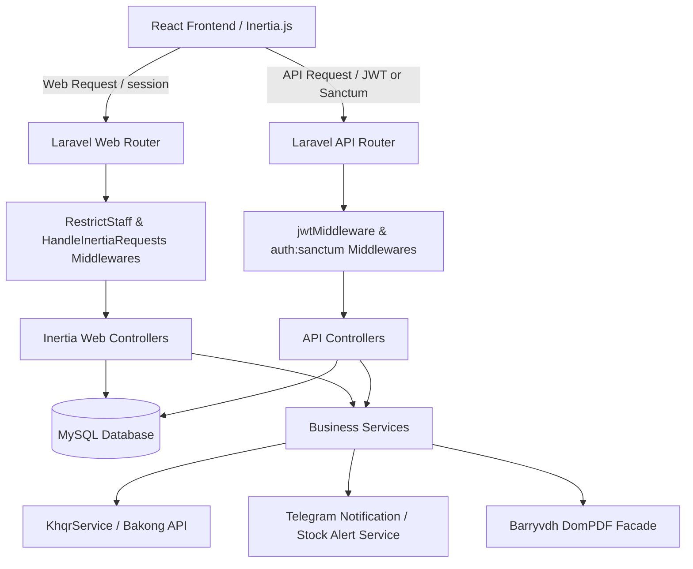
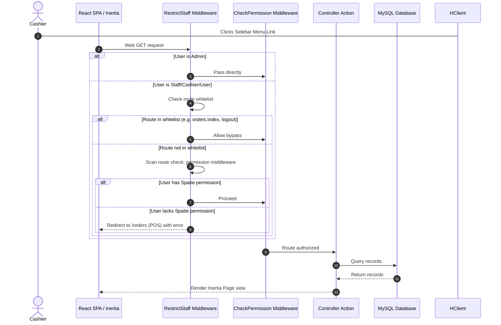
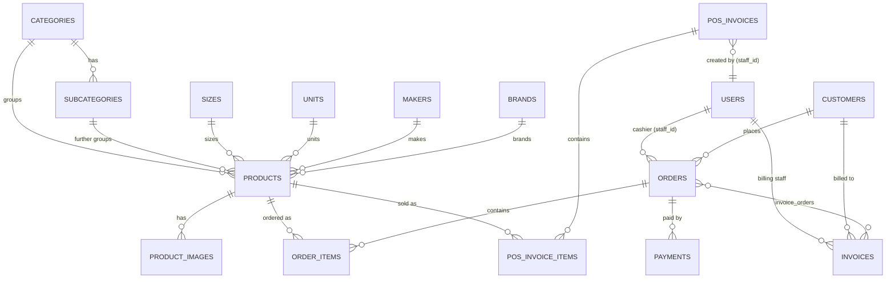
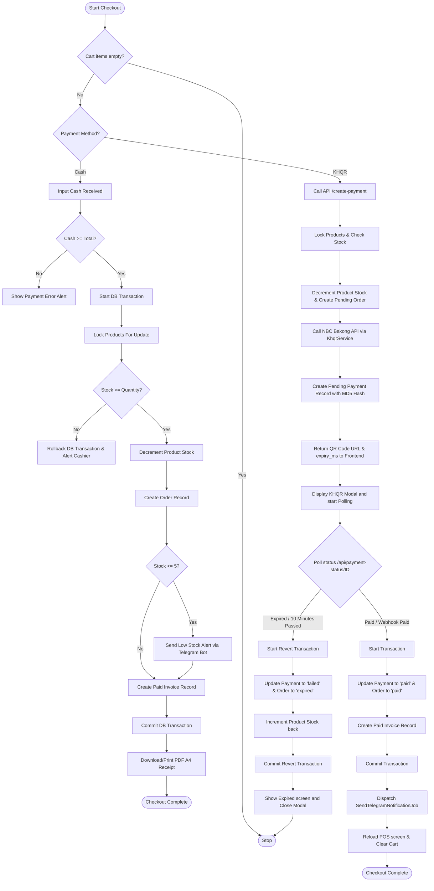

# Tos Tinh Mart — POS (Point of Sale) & Cashier Management System

A professional, comprehensive, and scalable Point of Sale (POS) and inventory control solution built for retail operations. This platform integrates core checkout services with dynamic digital payment processors (NBC Bakong KHQR) and real-time operations management alerts (Telegram Bot API integration).

---

## Table of Contents
1. [Features](#features)
2. [Screenshots](#screenshots-placeholders)
3. [Tech Stack](#tech-stack)
4. [System Architecture](#system-architecture)
5. [Database Relationships](#database-relationships)
6. [Project Structure](#project-structure)
7. [Installation Guide](#installation-guide)
8. [Environment Variables](#environment-variables)
9. [Database Setup & Seeders](#database-setup)
10. [User Roles & Permissions Matrix](#user-roles)
11. [System Workflows](#application-workflow)
12. [POS Checkout Workflows](#pos-workflow)
13. [Deployment Configurations](#deployment)
14. [Troubleshooting](#troubleshooting)
15. [Future Improvements](#future-improvements)

---

## Features

### 🛒 Checkout Terminals
* **Integrated Payments POS Terminal (`/orders`)**:
  * Real-time search and filter workspace by category or text.
  * Interactive cart supporting dynamic quantity incrementation, item removal, and multi-currency formatting ($ USD vs. ៛ KHR).
  * Transaction drawer allowing customer profiling, discount calculations, cash received input, and change calculation.
  * Embedded **Bakong KHQR payment gateway** supporting live QR code generation, countdown timers, verification polling, and mock webhook payment triggers.
* **Simple POS Interface (`/pos`)**:
  * A secondary fullscreen cashier viewport utilizing server-side database transaction locks (`lockForUpdate`) to prevent race conditions during rapid inventory stock-outs.
  * Direct checkout pushing line items directly to `pos_invoices` schema tracking.

### 📦 Inventory & Stock Variation
* **Product Catalog**: Full CRUD management with search, barcode tracking, product descriptions, custom image libraries, and status toggles.
* **Granular Attribute Categorization**: Built-in tables for Main Categories, Sub Categories, Sizes, Units, Makers, and Brands.
* **Low Stock Alerts**: Real-time notification hooks that send alerts to Telegram when any product's stock levels fall to or below the minimum threshold (default: 5 units).

### 🧾 Invoice & Receipt Management
* **Order-to-Invoice Mapping**: Combines one or more orders into consolidated invoices.
* **PDF Receipt Renderer**: Custom layout printouts compiled into A4 PDF documents generated via `barryvdh/laravel-dompdf` for cash registry records.

### 🤖 Telegram Automation
* **Outbound Payment Receipt Bot**: Automatically broadcasts successful cashier payments (order numbers, invoice IDs, totals, and transaction hashes) directly to store channels.
* **Daily Sales Report Scheduler**: Artisan console scheduler parsing today's transactional revenues, cash/QR aggregates, and quantities of items sold into automated Telegram summaries.
* **Contact Form Email Responder Webhook**: Incoming Telegram webhook parsing replies to contact inquiries to generate and log mock emails to disk.

### 🔒 Enterprise Security
* **Authentication**: Combined Inertia Session authentication for internal cashiers and JWT/Sanctum tokens for external API endpoints.
* **Route Lockdown Guard (`RestrictStaff`)**: Custom global middleware forcing Cashiers, Users, and Staff to be locked inside the POS screen, redirecting them away from administrative layouts unless explicitly granted Spatie page permissions.

---

## Screenshots (Placeholders)

* **POS checkout workspace**: ``
* **KHQR payment modal with countdown timer**: ``
* **System Settings & Telegram bot configuration panel**: ``
* **Artisan Daily Sales Report notification on Telegram**: ``

---

## Tech Stack

| Component | Technology | Version |
| :--- | :--- | :--- |
| **Backend Framework** | Laravel (PHP) | 11.9+ (PHP ^8.2) |
| **Frontend SPA** | React | 18.2.0 |
| **State Bridge** | Inertia.js | 1.0.0 |
| **Styling Framework** | Tailwind CSS & Bootstrap | Tailwind 3.2.1 / Bootstrap 4.3.1 |
| **Admin Layout Theme** | AdminLTE | 3.2.0 |
| **Database** | MySQL | 8.0+ |
| **API Auth Protocol** | JWT Auth (Tymon) & Sanctum | JWT 2.2 / Sanctum 4.0 |
| **PDF Processing** | Laravel DomPDF (Barryvdh) | 3.1 |

---

## System Architecture



### Request Flow & Middleware Restrictions

Administrative routes are protected by a dual layer of validation:
1. **`CheckPermission`**: Map endpoints to specific Spatie authorization tokens (e.g., `product.create`). Bypassed by members of the `Admin` role.
2. **`RestrictStaff`**: A catch-all middleware running on the web stack. If a non-admin user (with roles like `Staff`, `Cashier`, or `User`) hits a non-whitelisted route, the system checks Spatie permissions. If permissions are missing, they are immediately redirected to the POS checkout screen (`/orders`).



---

## Database Relationships

The high-level database architecture maps standard retail and categorization models:



---

## Project Structure

```bash
├── app/
│   ├── Console/
│   │   └── Commands/
│   │       └── SendSalesReport.php        # Daily Sales Telegram bot push
│   ├── Http/
│   │   ├── Controllers/
│   │   │   ├── Api/
│   │   │   │   ├── AuthController.php        # API JWT Auth operations
│   │   │   │   ├── PaymentApiController.php  # Bakong KHQR checkout & webhook simulation
│   │   │   │   ├── ReportApiController.php   # Manual trigger for Daily Sales Report
│   │   │   │   └── TelegramBotController.php # Telegram command listener webhooks
│   │   │   ├── InvoiceController.php         # Invoice list, manual creation, & PDF compiles
│   │   │   ├── PaymentController.php         # Core POS Payments landing page & cash store
│   │   │   └── ProductController.php         # Product CRUD & photo storage uploads
│   │   └── Middleware/
│   │       ├── CheckPermission.php           # Spatie permission validation middleware
│   │       ├── EnsureUserIsAdmin.php         # Admin role lock middleware
│   │       └── RestrictStaff.php             # Staff redirection wall middleware
│   ├── Models/
│   │   ├── Product.php                       # Base Product database mappings
│   │   ├── Order.php                         # Sales order metadata records
│   │   ├── Invoice.php                       # Billed invoices grouping orders
│   │   ├── PosInvoice.php                    # Simple POS schema records
│   │   └── User.php                          # Cashier accounts mapping Spatie roles
│   └── Services/
│       ├── KhqrService.php                   # NBC Bakong KHQR generation & check API
│       └── Notification/
│           ├── TelegramNotificationService.php  # Receipt Telegram notification dispatcher
│           └── TelegramStockAlertService.php    # Low inventory Telegram alert handler
├── config/
│   └── services.php                          # Configuration map for Telegram & Bakong
├── database/
│   ├── migrations/                           # Database table definition scripts
│   └── seeders/
│       ├── PermissionSeeder.php              # Full listing of security keys
│       └── UserSeeder.php                    # Default accounts (Admin, Staff, User)
├── resources/
│   ├── js/
│   │   ├── Components/
│   │   │   └── POSInterface.jsx              # Simple POS screen view component
│   │   ├── Layouts/
│   │   │   ├── AdminLayout.jsx               # Main dashboard administrative grid
│   │   │   └── MenuSideBar.jsx               # Left sidebar navigation links
│   │   └── Pages/
│   │       ├── Dashboard.jsx                 # Business metrics dashboard
│   │       └── Payments/
│   │           ├── Index.jsx                 # Dynamic POS payments landing component
│   │           ├── components/               # Catalog, cart, KHQR and checkout modals
│   │           └── hooks/
│   │               └── usePaymentPOS.js      # Cart hook handling polling and status checks
│   └── views/
│       └── invoices/
│           └── pdf.blade.php                 # Blade view compiled into PDF receipts
└── routes/
    ├── api.php                               # JWT & Sanctum API routes
    ├── console.php                           # Scheduled commands declaration
    └── web.php                               # Web session routes
```

---

## Installation Guide

### Prerequisites
* PHP >= 8.2 with local database extensions (`pdo_mysql`, `gd`, `openssl`, `mbstring`, `xml`).
* Composer (PHP dependency manager).
* Node.js (with NPM).
* MySQL Database server running locally or accessible remotely.

### 1. Clone the Repository
```bash
git clone https://github.com/Xianghao1108/TOS_TINH-POS-SYSTEM.git
cd TOS_TINH-POS-SYSTEM
```

### 2. Install PHP & Frontend Dependencies
```bash
composer install
npm install
```

### 3. Setup Environment File
Copy the example environment template:
```bash
copy .env.example .env
```
Open `.env` and fill in your database credentials:
```env
DB_CONNECTION=mysql
DB_HOST=127.0.0.1
DB_PORT=3306
DB_DATABASE=tostinh_pos
DB_USERNAME=root
DB_PASSWORD=yourpassword
```

### 4. Generate Application Encryption Keys
Generate the Laravel app security key and the Tymon JWT auth secret token:
```bash
php artisan key:generate
php artisan jwt:secret
```

### 5. Run Database Migrations & Seed Default Data
Create the database tables and populate the system with pre-configured Spatie permissions and default user accounts:
```bash
php artisan migrate
php artisan db:seed --class=PermissionSeeder
php artisan db:seed --class=UserSeeder
```

### 6. Create Storage Link for Product Images
Link Laravel's public storage path to make uploaded product images accessible:
```bash
php artisan storage:link
```

### 7. Run the Application
Start the PHP server and compile frontend assets concurrently (or run in separate terminals):
```bash
# Start concurrently (server, queue worker, scheduler, logs, and vite)
composer dev

# Or run separately:
# Terminal 1
php artisan serve

# Terminal 2
npm run dev
```
Open your browser and navigate to `http://127.0.0.1:8000`.

---

## Environment Variables

| Variable Key | Description | Default / Example Value | Required |
| :--- | :--- | :--- | :--- |
| `APP_ENV` | Application environment state | `local` | Yes |
| `APP_KEY` | Laravel application encryption key | `base64:...` | Yes |
| `JWT_SECRET` | Secret hash key for signing JWT tokens | Generated via `jwt:secret` | Yes |
| `DB_CONNECTION` | Database engine driver | `mysql` | Yes |
| `DB_DATABASE` | Name of the database schema | `sample_laravel_11` | Yes |
| `QUEUE_CONNECTION` | Background job processing queue driver | `database` | Yes |
| `BAKONG_API_URL` | NBC Bakong API Sandbox endpoint | `https://sit-api-bakong.nbc.gov.kh/` | Yes (for QR) |
| `BAKONG_API_TOKEN`| Developer authorization key for Bakong | `your_token_here` | Yes (for QR) |
| `BAKONG_ACCOUNT_ID`| Target merchant Bakong account code | `tos_tinh_store@usd` | Yes (for QR) |
| `BAKONG_SECRET_KEY`| Webhook payload signature hashing key | `bakong_secret_passphrase_123` | Yes (for QR) |
| `TELEGRAM_BOT_TOKEN` | Bot API token for successful payment receipt pushes | `123456:ABC-Def...` | Optional |
| `TELEGRAM_CHAT_ID` | Group/Channel chat ID for receipt logs | `-10012345678` | Optional |
| `TELEGRAM_STOCK_BOT_TOKEN` | Bot API token for low stock alerts | `123456:XYZ-Wuv...` | Optional |
| `TELEGRAM_STOCK_CHAT_ID` | Group/Channel chat ID for low stock alerts | `-10098765432` | Optional |
| `TELEGRAM_REPORT_BOT_TOKEN`| Bot API token for scheduled sales report | `123456:MNO-Pqr...` | Optional |
| `TELEGRAM_REPORT_CHAT_ID` | Group/Channel chat ID for sales summaries | `-10045678901` | Optional |

---

## Database Setup

* **Migrations**: Define tables for products, categories, attributes, users, roles, order items, and transactions. Included cascade constraints ensure that deleting an order or product safely cleans up items.
* **`PermissionSeeder`**: Seeds authorization tags parsed by route checks (e.g. `page.dashboard`, `product.create`, `order.cancel`).
* **`UserSeeder`**: Establishes default test credentials:
  * **Admin Account**: Email: `admin@gmail.com` \| Password: `123456`
  * **Secondary Admin**: Email: `seanghavtoun@gmail.com` \| Password: `123456`
  * **Staff Account**: Email: `staff@gmail.com` \| Password: `123456`

---

## User Roles

The system operates under three primary Spatie user roles, with permission matrices defined as:

| Role Name | Access Level Description | Dashboard (`/dashboard`) | POS Checkout (`/orders`) | Product Management (`/products`) | Administrative Options |
| :--- | :--- | :---: | :---: | :---: | :---: |
| **Admin** | Unrestricted database control, cashier logging, and setting configurations | ✅ Yes | ✅ Yes | ✅ Yes | ✅ Yes |
| **Staff** | Daily operations cashier. Allowed product creation, category updates, and order generation | ❌ Redirected | ✅ Yes | ✅ Yes | ❌ Blocked |
| **User** | Walk-in/API account restricted exclusively to point-of-sale operations | ❌ Redirected | ✅ Yes | ❌ Blocked | ❌ Blocked |

---

## Application Workflow

```
[Cashier Login] ──> [Dashboard / Metrics]
                           │
             (If Staff, redirects automatically)
                           │
                           ▼
                  [POS Orders Screen]
                           │
                  [Add Items to Cart]
                           │
              [Configure Cashier Details]
             (Add customer, apply discount)
                           │
                           ▼
                 [Select Payment Method]
                  /                 \
            (Cash Pay)            (KHQR Scan)
               /                       \
        [Input Cash]            [Generate Dynamic QR]
              │                          │
        [Verify Total]          [Poll Bakong Status]
              │                          │
              ▼                          ▼
      [DB Transaction]          [Webhook Notification]
    (Decrement stock)              (Verify signature)
              │                          │
              └────────────┬─────────────┘
                           │
                           ▼
                 [Print PDF Receipt]
                 [Telegram Alerts]
```

---

## POS Checkout Workflows



### Cash Checkout Workflow
1. Cashier adds products to cart from the `/orders` screen.
2. Selects payment method **Cash** in checkout drawer.
3. Enters the amount of cash received. The frontend dynamically calculates the change due.
4. Click **Confirm Payment**.
5. The system initiates a database transaction:
   * Locks affected product records (`lockForUpdate`).
   * Validates available inventory stock.
   * Decrements stock count.
   * Creates an `Order` and matching `OrderItem` rows.
   * Creates a **Paid** `Invoice` (status = 1) referencing the order ID.
   * Dispatches a Telegram Stock alert if remaining stock drops below the threshold.
6. The POS cart is cleared, and the screen reloads.

### Bakong KHQR Checkout Workflow
1. Cashier adds products to cart, selects payment method **KHQR** (represented as `qr`), and selects currency ($ USD or ៛ KHR).
2. Clicking **Pay** calls the API endpoint `/api/create-payment`.
3. The server locks product records, validates stock, and records a pending order with status `pending`.
4. It calls NBC Bakong Sandbox API via the `KhqrService` helper, providing the store’s credentials and transaction details.
5. A pending `Payment` is created, and the server returns the generated QR image URL and an MD5 hash.
6. The frontend opens the `KhqrModal`, showing the QR scan code and starting a 10-minute countdown.
7. The React client polls `/api/payment-status/{id}` every 2 seconds.
8. When the payment is processed (either via successful API status verification, official Bakong Webhook callback, or mock simulation buttons):
   * The server updates the order status and payment status to `paid`.
   * An associated `Invoice` with status `paid` (1) is created.
   * A queue job `SendTelegramNotificationJob` is dispatched to send the receipt details to the designated Telegram channel.
   * The client cart clears, and the modal is dismissed.
9. If 10 minutes pass without payment, the countdown expires:
   * The server updates status to `failed` / `expired`.
   * Database stock numbers are automatically reverted.

---

## Deployment

### Environment Configurations
When deploying to hosting services like **Railway**, configure the service variables within Railway’s variables panel (do not commit production keys to your repository). Ensure `APP_ENV=production` and `APP_DEBUG=false`.

### File Storage
Because standard cloud deployment directories are ephemeral, configure the application to use storage buckets (like AWS S3) for product photos, or use a persistent path volume on Railway attached to the `storage/app/public` folder.

### Queue Workers
To process Telegram notification jobs asynchronously and ensure fast cashier checkouts, keep a queue runner active in production:
```bash
php artisan queue:work
```
On production servers, manage the queue worker process using **Supervisor** or systemd. Below is an example Supervisor configuration:
```ini
[program:laravel-worker]
process_name=%(program_name)s_%(process_num)02d
command=php /var/www/tostinh/artisan queue:work --sleep=3 --tries=3 --max-time=3600
autostart=true
autorestart=true
stopasgroup=true
killasgroup=true
user=forge
numprocs=8
redirect_stderr=true
stdout_logfile=/var/www/tostinh/storage/logs/worker.log
stopwaitsecs=3600
```

### Scheduled Task Cron
Ensure the Laravel Scheduler runs continuously by adding the following cron string to your hosting environment or server crontab configuration (`crontab -e`):
```bash
* * * * * cd /path-to-your-project && php artisan schedule:run >> /dev/null 2>&1
```

---

## Troubleshooting

### 1. MD5 Webhook Signature Mismatch
* **Symptom**: Webhook payloads are rejected with a signature mismatch error.
* **Solution**: Ensure the `BAKONG_SECRET_KEY` env variable on the server matches the secret passphrase configured in your Bakong portal (default: `bakong_secret_passphrase_123`).

### 2. Missing Application Key Error
* **Symptom**: The homepage displays `RuntimeException: No application encryption key has been specified.`
* **Solution**: Generate the key by running `php artisan key:generate`.

### 3. JWT Token Validation Failures
* **Symptom**: API endpoints return `Unauthorized` or `Tymon\JWTAuth\Exceptions\JWTException`.
* **Solution**: Run `php artisan jwt:secret` to verify that the token signing key is active in your `.env` file.

### 4. Queue Jobs Fail / Telegram Messages Not Received
* **Symptom**: Payments succeed, but notifications are not received.
* **Solution**: Check that the queue worker is running (`php artisan queue:listen` or `queue:work`). If utilizing sync queue for debugging, update `QUEUE_CONNECTION=sync` in your `.env`. Verify your Telegram Bot settings.

---

## Future Improvements

1. **WebSocket Status Updates**: Implement real-time status updates via WebSockets (e.g. Laravel Reverb or Pusher) instead of polling `/api/payment-status` every 2 seconds during checkout.
2. **Real-time Currency Conversion**: Integrate a real-time exchange rate API to dynamically convert USD to KHR based on active exchange rates, replacing the hardcoded `1 USD = 4100 KHR` exchange rate.
3. **Advanced Analytics**: Add sales graphs, top category charts, and cashier metrics to the Dashboard.

---

## License

This software is released under the [MIT License](LICENSE).
